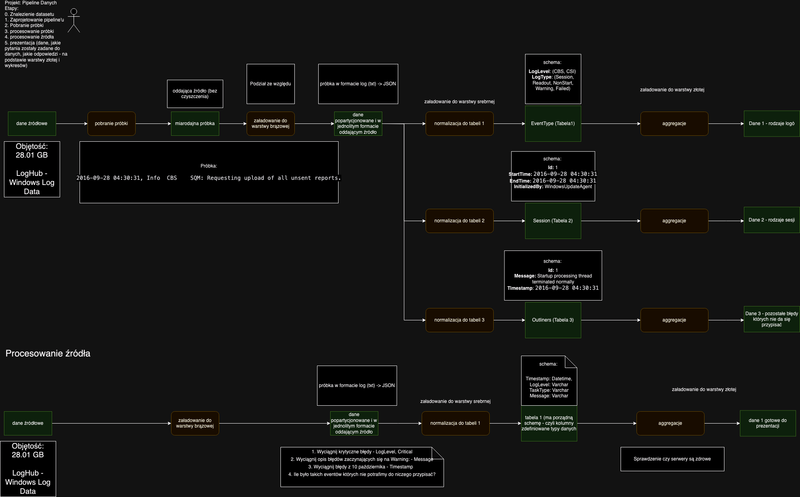

# Project BigData

Raz odpalamy docker a póżniej jeśli są robione zmian yw kodzie to wystarczy odświeżyć stronę.

Worker - http://localhost:9090/
Airflow - http://localhost:8080/home

Jeśli nie działa połączenie z sparkiem to trzeba sprawdzić połącznia w Airflow (Admin -> Connectons)

Jeśli jest puste to dodać spark-conn:
Conn Id spark-conn
Conn type Spark
Host spark://172.19.0.3 (to się sprawdza tu http://localhost:9090/ na samej górze jest podany url do sparka)
port 7077

Diagram:

Template from https://github.com/airscholar/SparkingFlow 
